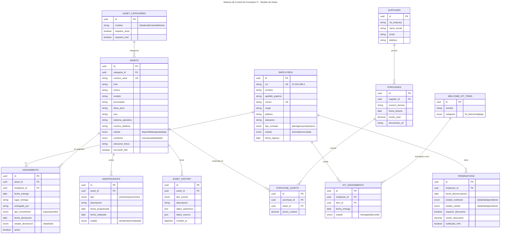
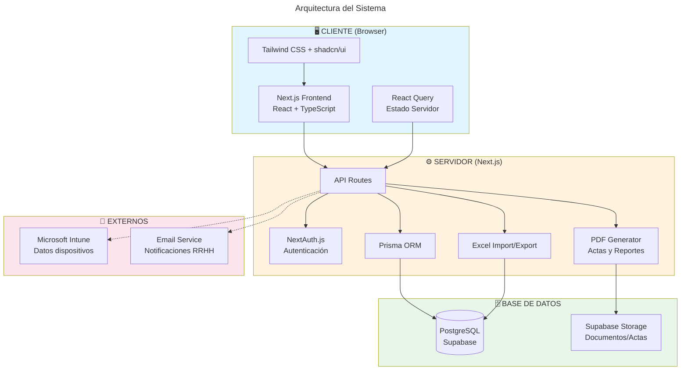
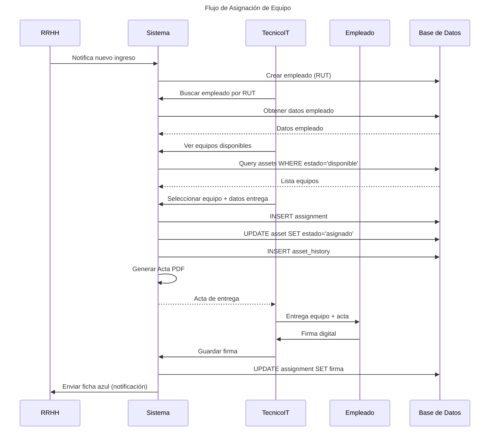
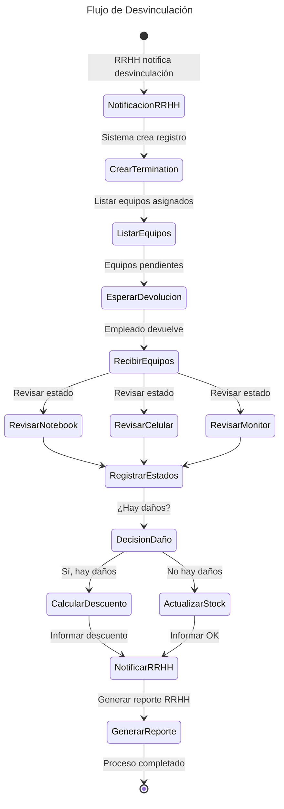
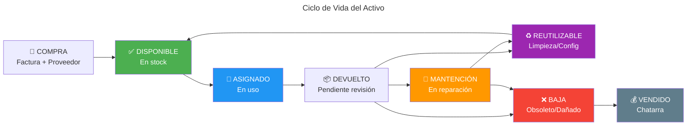
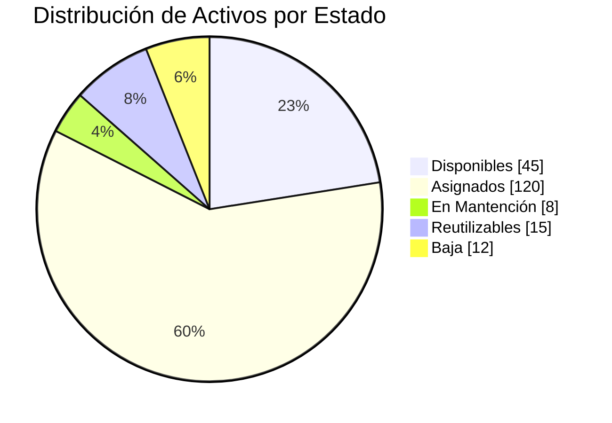

```mermaid
---
title: Sistema de Control de Inventario IT - Modelo de Datos
---
erDiagram
    EMPLOYEES ||--o{ ASSIGNMENTS : "tiene"
    EMPLOYEES ||--o{ KIT_ASSIGNMENTS : "recibe"
    EMPLOYEES ||--o{ TERMINATIONS : "tiene"
    
    ASSET_CATEGORIES ||--o{ ASSETS : "categoriza"
    
    ASSETS ||--o{ ASSIGNMENTS : "es asignado"
    ASSETS ||--o{ MAINTENANCES : "recibe"
    ASSETS ||--o{ ASSET_HISTORY : "tiene"
    ASSETS ||--o{ PURCHASE_ASSETS : "comprado en"
    
    SUPPLIERS ||--o{ PURCHASES : "provee"
    PURCHASES ||--o{ PURCHASE_ASSETS : "incluye"
    
    WELCOME_KIT_ITEMS ||--o{ KIT_ASSIGNMENTS : "entregado como"

    EMPLOYEES {
        uuid id PK
        string rut UK "21.523.308-1"
        string nombre
        string apellido_paterno
        string correo UK
        string cargo
        string jefatura
        string ubicacion
        enum tipo_contrato "planta|proyecto|externo"
        enum estado "activo|desvinculado"
        date fecha_ingreso
    }

    ASSET_CATEGORIES {
        uuid id PK
        string nombre "Notebook|Celular|Monitor"
        boolean requiere_serie
        boolean requiere_imei
    }

    ASSETS {
        uuid id PK
        uuid categoria_id FK
        string numero_serie UK
        string imei
        string marca
        string modelo
        string procesador
        string disco_duro
        string ram
        string sistema_operativo
        string numero_telefono
        enum estado "disponible|asignado|baja"
        enum condicion "nuevo|usado|dañado"
        string ubicacion_fisica
        boolean microsoft_365
    }

    ASSIGNMENTS {
        uuid id PK
        uuid asset_id FK
        uuid employee_id FK
        date fecha_entrega
        string lugar_entrega
        string entregado_por
        enum tipo_movimiento "ingreso|cambio"
        date fecha_devolucion
        enum estado_devolucion "ok|dañado"
        boolean activo
    }

    SUPPLIERS {
        uuid id PK
        string rut_empresa
        string razon_social
        string email
        string telefono
    }

    PURCHASES {
        uuid id PK
        uuid supplier_id FK
        string numero_factura
        date fecha_factura
        decimal monto_total
        string documento_url
    }

    PURCHASE_ASSETS {
        uuid id PK
        uuid purchase_id FK
        uuid asset_id FK
        decimal precio_unitario
    }

    MAINTENANCES {
        uuid id PK
        uuid asset_id FK
        enum tipo "preventiva|correctiva"
        string descripcion
        date fecha_programada
        date fecha_realizada
        enum estado "pendiente|completada"
    }

    ASSET_HISTORY {
        uuid id PK
        uuid asset_id FK
        enum tipo_evento
        string descripcion
        json datos_anteriores
        json datos_nuevos
        datetime created_at
    }

    WELCOME_KIT_ITEMS {
        uuid id PK
        string nombre
        enum categoria "kit_bienvenida|epp"
    }

    KIT_ASSIGNMENTS {
        uuid id PK
        uuid employee_id FK
        uuid item_id FK
        date fecha_entrega
        enum estado "entregado|devuelto"
    }

    TERMINATIONS {
        uuid id PK
        uuid employee_id FK
        date fecha_desvinculacion
        enum estado_notebook "ok|dañado|pendiente"
        enum estado_celular "ok|dañado|pendiente"
        boolean requiere_descuento
        decimal monto_descuento
        boolean notificado_rrhh
    }
```

---

```mermaid
---
title: Arquitectura del Sistema
---
flowchart TB
    subgraph Cliente["🖥️ CLIENTE (Browser)"]
        UI[Next.js Frontend<br/>React + TypeScript]
        TW[Tailwind CSS + shadcn/ui]
        RQ[React Query<br/>Estado Servidor]
    end

    subgraph Server["⚙️ SERVIDOR (Next.js)"]
        API[API Routes]
        AUTH[NextAuth.js<br/>Autenticación]
        PRISMA[Prisma ORM]
        PDF[PDF Generator<br/>Actas y Reportes]
        EXCEL[Excel Import/Export]
    end

    subgraph Database["🗄️ BASE DE DATOS"]
        PG[(PostgreSQL<br/>Supabase)]
        STORAGE[Supabase Storage<br/>Documentos/Actas]
    end

    subgraph External["🔗 EXTERNOS"]
        INTUNE[Microsoft Intune<br/>Datos dispositivos]
        EMAIL[Email Service<br/>Notificaciones RRHH]
    end

    UI --> API
    TW --> UI
    RQ --> API
    
    API --> AUTH
    API --> PRISMA
    API --> PDF
    API --> EXCEL
    
    PRISMA --> PG
    PDF --> STORAGE
    EXCEL --> PG
    
    API -.-> INTUNE
    API -.-> EMAIL

    style Cliente fill:#e1f5fe
    style Server fill:#fff3e0
    style Database fill:#e8f5e9
    style External fill:#fce4ec
```

---

```mermaid
---
title: Flujo de Asignación de Equipo
---
sequenceDiagram
    participant RRHH
    participant Sistema
    participant TecnicoIT
    participant Empleado
    participant BD as Base de Datos

    RRHH->>Sistema: Notifica nuevo ingreso
    Sistema->>BD: Crear empleado (RUT)
    
    TecnicoIT->>Sistema: Buscar empleado por RUT
    Sistema->>BD: Obtener datos empleado
    BD-->>Sistema: Datos empleado
    
    TecnicoIT->>Sistema: Ver equipos disponibles
    Sistema->>BD: Query assets WHERE estado='disponible'
    BD-->>Sistema: Lista equipos
    
    TecnicoIT->>Sistema: Seleccionar equipo + datos entrega
    Sistema->>BD: INSERT assignment
    Sistema->>BD: UPDATE asset SET estado='asignado'
    Sistema->>BD: INSERT asset_history
    
    Sistema->>Sistema: Generar Acta PDF
    Sistema-->>TecnicoIT: Acta de entrega
    
    TecnicoIT->>Empleado: Entrega equipo + acta
    Empleado->>TecnicoIT: Firma digital
    
    TecnicoIT->>Sistema: Guardar firma
    Sistema->>BD: UPDATE assignment SET firma
    
    Sistema->>RRHH: Enviar ficha azul (notificación)
```

---

```mermaid
---
title: Flujo de Desvinculación
---
stateDiagram-v2
    [*] --> NotificacionRRHH: RRHH notifica desvinculación
    
    NotificacionRRHH --> CrearTermination: Sistema crea registro
    CrearTermination --> ListarEquipos: Listar equipos asignados
    
    ListarEquipos --> EsperarDevolucion: Equipos pendientes
    EsperarDevolucion --> RecibirEquipos: Empleado devuelve
    
    RecibirEquipos --> RevisarNotebook: Revisar estado
    RecibirEquipos --> RevisarCelular: Revisar estado
    RecibirEquipos --> RevisarMonitor: Revisar estado
    
    RevisarNotebook --> RegistrarEstados
    RevisarCelular --> RegistrarEstados
    RevisarMonitor --> RegistrarEstados
    
    RegistrarEstados --> DecisionDaño: ¿Hay daños?
    
    DecisionDaño --> CalcularDescuento: Sí, hay daños
    DecisionDaño --> ActualizarStock: No hay daños
    
    CalcularDescuento --> NotificarRRHH: Informar descuento
    ActualizarStock --> NotificarRRHH: Informar OK
    
    NotificarRRHH --> GenerarReporte: Generar reporte RRHH
    GenerarReporte --> [*]: Proceso completado
```

---

```mermaid
---
title: Ciclo de Vida del Activo
---
flowchart LR
    COMPRA[🛒 COMPRA<br/>Factura + Proveedor]
    DISPONIBLE[✅ DISPONIBLE<br/>En stock]
    ASIGNADO[👤 ASIGNADO<br/>En uso]
    DEVUELTO[📦 DEVUELTO<br/>Pendiente revisión]
    MANTENCION[🔧 MANTENCIÓN<br/>En reparación]
    REUTILIZABLE[♻️ REUTILIZABLE<br/>Limpieza/Config]
    BAJA[❌ BAJA<br/>Obsoleto/Dañado]
    VENDIDO[💰 VENDIDO<br/>Chatarra]

    COMPRA --> DISPONIBLE
    DISPONIBLE --> ASIGNADO
    ASIGNADO --> DEVUELTO
    DEVUELTO --> MANTENCION
    DEVUELTO --> REUTILIZABLE
    DEVUELTO --> BAJA
    MANTENCION --> REUTILIZABLE
    MANTENCION --> BAJA
    REUTILIZABLE --> DISPONIBLE
    BAJA --> VENDIDO
    
    style DISPONIBLE fill:#4caf50,color:#fff
    style ASIGNADO fill:#2196f3,color:#fff
    style MANTENCION fill:#ff9800,color:#fff
    style REUTILIZABLE fill:#9c27b0,color:#fff
    style BAJA fill:#f44336,color:#fff
    style VENDIDO fill:#607d8b,color:#fff
```

---

```mermaid
---
title: Dashboard - KPIs Principales
---
pie showData
    title Distribución de Activos por Estado
    "Disponibles" : 45
    "Asignados" : 120
    "En Mantención" : 8
    "Reutilizables" : 15
    "Baja" : 12
```
